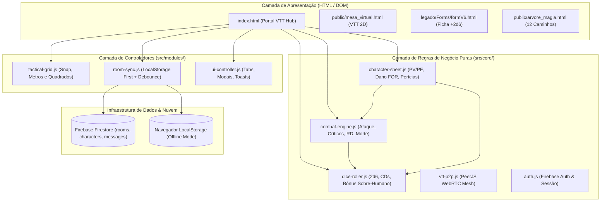
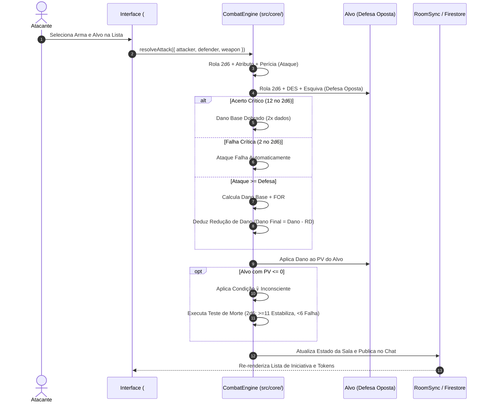

# 🌌 Portal Kuar-Tor: A Última Expedição & VTT (+2d6)

<p align="center">
  
  
  
  
</p>

> *"Onde a magia antiga encontra a tecnologia proibida. Operativo, bem-vindo ao nexo da sua sobrevivência."*

O **Portal Kuar-Tor** é uma plataforma integrada de Virtual Tabletop (VTT), gestão de fichas e suporte a campanhas de RPG baseadas no **Sistema +2d6 (v2.3 de Newton Rocha)** em um cenário épico de **Dark Fantasy / Cyber-Arcana**.

---

## 🏗️ Arquitetura Modular e Separação de Responsabilidades (SoC)

A base de código é estruturada em camadas independentes com alta coesão e baixo acoplamento:



---

## 📁 Estrutura de Diretórios

```text
RPG/
├── index.html                   # Portal Principal & Mesa Virtual Integrada
├── firestore.rules              # Regras de Segurança do Firebase Firestore
├── tailwind.config.js           # Configurações do Design System Tailwind
├── .agents/
│   └── skills/
│       └── code-refactoring/    # Skill oficial de refatoração segura (Regressão Zero)
├── src/
│   ├── core/                    # Regras de Negócio Puras (Sem dependência de DOM)
│   │   ├── combat-engine.js     # Motor de combate, testes opostos, RD e testes de morte
│   │   ├── dice-roller.js       # Mecânica 2d6, CDs, bônus sobre-humano/divino e logs
│   │   ├── character-sheet.js   # Cálculos de ficha +2d6 v2.3, status derivados e perícias
│   │   ├── vtt-p2p.js           # Módulo WebRTC PeerJS multiplayer sem servidor
│   │   ├── auth.js              # Gerenciador de autenticação Firebase Auth e UI de perfil
│   │   └── firebase-config.js   # Credenciais e inicialização do Firebase SDK
│   ├── modules/                 # Controladores de Subsistemas do VTT
│   │   ├── tactical-grid.js     # Gestão do Grid 2D, réguas de distância e snap magnético
│   │   ├── room-sync.js         # Sincronização híbrida: LocalStorage First + Firestore
│   │   └── ui-controller.js     # Gerenciamento de abas, gaveta de tomos e modais
│   └── styles/
│       └── theme.css            # Variáveis CSS, Glassmorphism e paleta Dark Fantasy
├── tests/                       # Suíte Completa de Testes Automatizados (QUnit)
│   ├── modular-architecture.test.js
│   ├── combat-turn-manager.test.js
│   ├── combat-resolution-and-death.test.js
│   ├── character-sheet-rules.test.js
│   ├── firebase-firestore-vtt.test.js
│   ├── firebase-multi-room.test.js
│   ├── firestore-permission-resilience.test.js
│   ├── portal-redesign.test.js
│   ├── skill-refactoring.test.js
│   └── vtt-p2p.test.js
└── public/                      # Páginas de recursos e tomos da campanha
    ├── mesa_virtual.html        # Grid Tático VTT 2D Dedicado
    ├── arvore_magia.html        # Biblioteca Arcana (12 Caminhos Daemon & Fusão)
    ├── items.html               # Gerenciador de Inventário
    └── puzzles/                 # Salão de Quebra-Cabeças
```

---

## ⚔️ Fluxo de Resolução de Combate em 1 Clique (+2d6)



---

## 🚀 Como Executar o Projeto Localmente

### 1. Pré-requisitos
- Node.js instalado (v16 ou superior).
- Navegador moderno (Google Chrome, Edge, Firefox ou Safari).

### 2. Executar a Suíte de Testes Unitários
Para validar os **86 testes automatizados**:
```bash
npm test
```

### 3. Iniciar o Servidor de Desenvolvimento
Você pode usar qualquer servidor estático ou o Firebase CLI:
```bash
# Opção A: Usando live-server / npx
npx live-server --port=8080

# Opção B: Usando Firebase CLI
firebase serve --only hosting
```

---

## 🔒 Regras de Segurança do Firestore (`firestore.rules`)

Para habilitar sincronização em tempo real entre múltiplos dispositivos no Firebase Console:
1. Acesse o [Firebase Console](https://console.firebase.google.com/).
2. Selecione o projeto `rpg---mesa` &rarr; **Firestore Database** &rarr; **Regras (Rules)**.
3. Copie o conteúdo de [`firestore.rules`](./firestore.rules) e clique em **Publicar**.

---

## 📜 Licença
Distribuído sob a licença MIT. Desenvolvido para a comunidade do Sistema +2d6 de RPG.